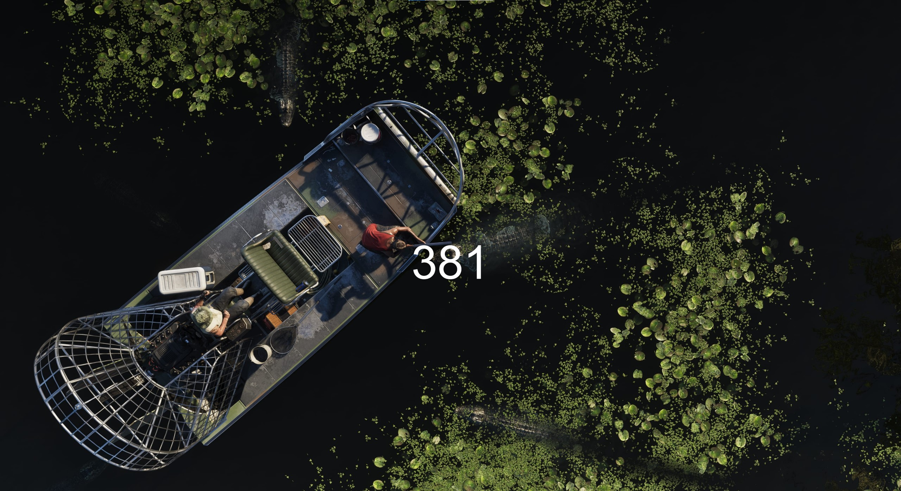

# GTA 6 Countdown Wallpaper

A simple Python script that displays the number of days left until the release of **GTA 6** directly on your desktop wallpaper.  
The countdown is dynamically updated on startup, overlaying the number of days on a **random screenshot** from the Rockstar Games website. Images can be added / modified manually, without touching any code.

---

  
*Sample output with a random screenshot background*

---

## 🧩 Features

- Randomly selects a background image from the `/screenshots` folder
- Overlays the number of days remaining until the release date
- Automatically sets the wallpaper on startup
- Clean and readable centered text
- Works with `.png`, `.jpg`, and `.jpeg` screenshots

---

## 🛠️ Requirements

- Python 3.6+
- [Pillow](https://pypi.org/project/Pillow/) (Python Imaging Library)
- Windows OS (for wallpaper setting functionality)

Install dependencies using:

```bash
pip install pillow
```

---

## ⚙️ Setup

1. Place PLACE_IN_STARTUP_FOLDER.ink into the Windows startup folder.

---

## 🖼️ Customize

- Modify text size or font in the script if needed.

---


Made for fun by Morso33 – contributions welcome!
